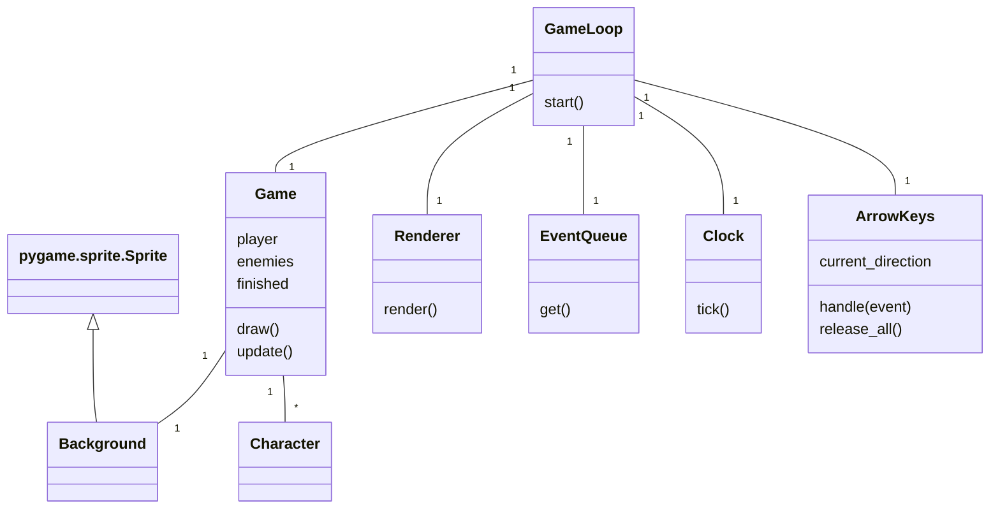
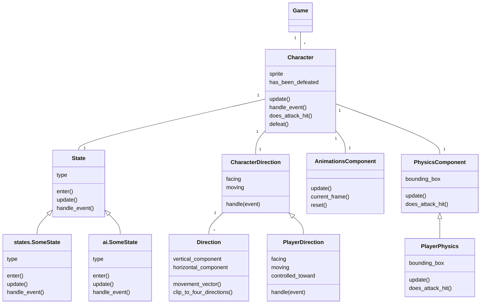
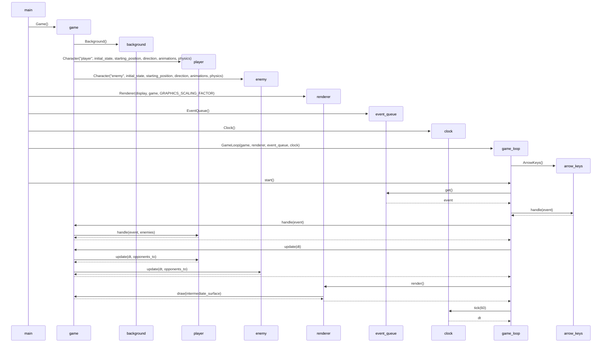

# Architecture description

## Structure

## Game loop

The basic function of the game loop is presented as a sequence diagram below. The diagram includes the initialization of the game loop and one iteration. Animation states and AI states are excluded from the diagram.

