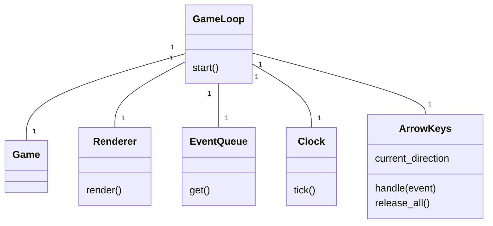
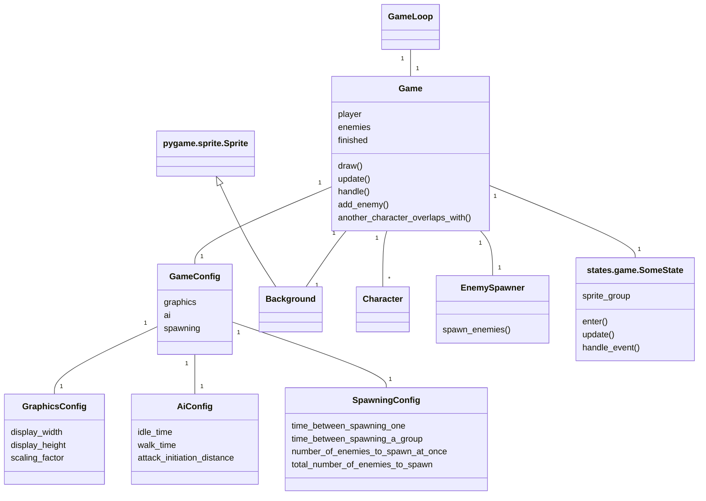
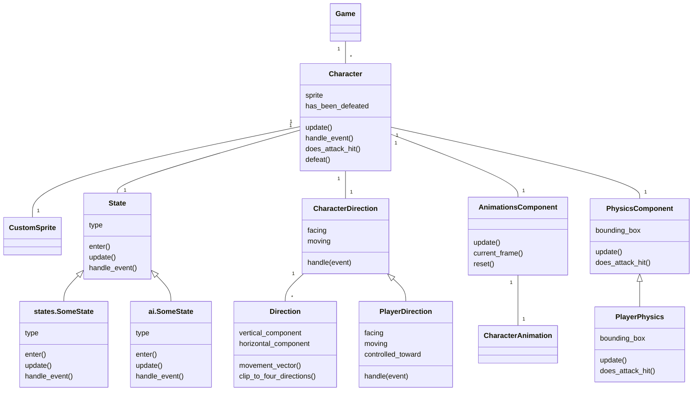
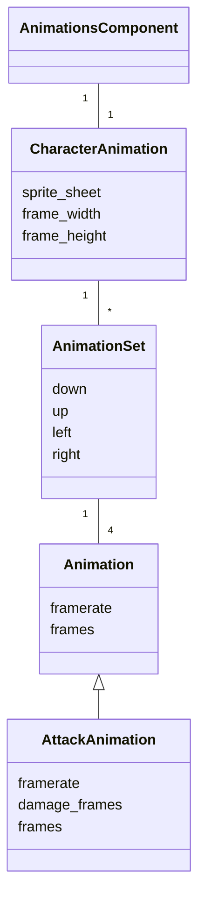
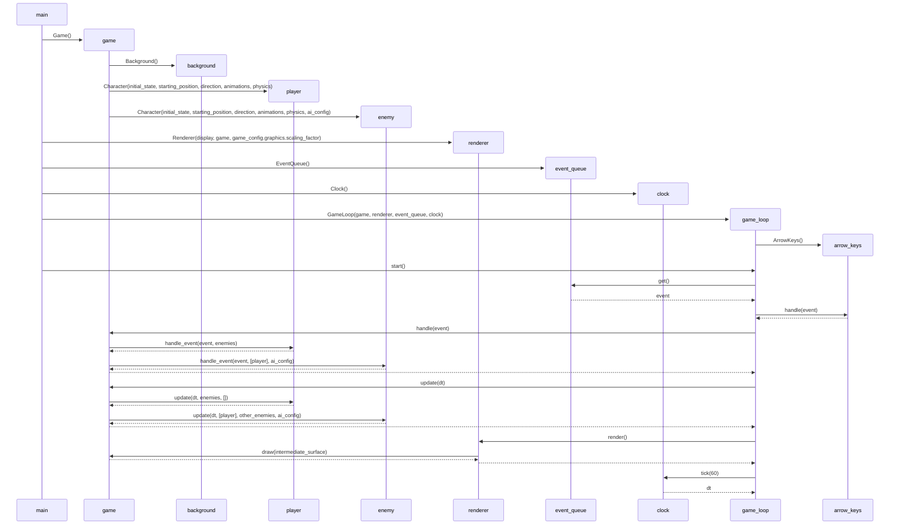

# Architecture

## Structure

*GameLoop* class runs the game loop and utilizes the classes *Renderer*, *EventQueue*, *Clock*, *ArrowKeys* and *Game*. These relationships between the classes are depicted below:

The game logic is contained in the *Game* class. The *Game* class contains a *GameConfig* instance that has the configuration of the game. Furthermore *GameConfig* contains subconfiguration instances *GraphicsConfig*, *AiConfig* and *SpawningConfig* that have the actual configuration values stored. The *Game* class also contains a *Background* instance for drawing the game background and then several *Character* instances: one player and multiple enemies. The *EnemySpawner* class is responsible for creating new enemies during the game. The classes *states.game.CinematicsTextState*, *states.game.PlayState*, *states.game.VictoryScreenState* and *states.game.DefeatScreenState* define the game states that the game can be in. Forementioned relationships are depicted in the diagram below:

The game character logic is contained in the *Character* class. The directional data of the character is handled by the *CharacterDirection* class, the animations are handled by the *AnimationsComponent* class, and the character movement and collision detection is handled by the *PhysicsComponent* class. The state transitions of the character (*idle* -> *walking* -> *attacking* etc.) are handled by the subclasses of the *State* class (player states are inside the *states* directory and enemy states inside the *ai* directory). All these relationships are depicted below:

Character animations are stored in a hierarchy of classes. The top class *CharacterAnimation* contains multiple *AnimationSet* instances, which each has one type of animation (e.g. idle, walking). A *AnimationSet* contains four versions of the *Animation*, one for each four directions that the characters can face. These are shown below:

## Game logic

### Game loop

The basic function of the game loop is presented as a sequence diagram below. The diagram includes the initialization of the game loop and one iteration. Animation states and AI states are excluded from the diagram.

### Player and AI states

The initial state of the game character is passed to the *Character* constructor in the *initial_state* parameter (for a player character the initial state is usually *states.idle_state.IdleState()* and for an enemy character *ai.idle_state.IdleState()*). The *update()* method of the current state is called each game loop iteration and the *handle_event()* method of the state when another game component sends a game event to the character (e.g. the *Game* object sends a *PlayerWon* event).

Both the *update()* method and the *handle_event()* either return another state or *None*. When they return another state, the character will change its current state to that state. So for example if the player character's current state is *IdleState* and it receives the *AttackStarted* event in its *handle_event()* method, then the *handle_event()* method would return an *AttackState* and the player character would change its state to that state.

The *enter()* method of a state is called the first thing when a character has changed its current state to that state. It does any preparatory tasks required by the state such as update the movement direction of the character if the new state is a *WalkState*.

### Game states

The game has four possible game states: *CinematicTextsState*, *PlayState*, *VictoryScreenState* and *DefeatScreenState*. The initial state is *CinematicTextsState*, in which narrative texts are shown in the beginning of the game. After the player has finished the texts, the game transitions to the actual gameplay state *PlayState*. Then after either winning or losing the game, the game transitions either to *VictoryScreenState* or *DefeatScreenState* respectively.

The *update()* method of the current state is called each game loop iteration and the *handle_event()* method of the state when another game component sends a game event to the game.

The *handle_event()* either returns another state or *None*. When it returns another state, the game will change its current state to that state. So for example if the game's current state is *PlayState* and it receives the *PlayerWon* event in its *handle_event()* method, then the *handle_event()* method would return a *VictoryScreenState* and the game would change its state to that state.

The *enter()* method of a state is called the first thing when the game has changed its current state to that state. It does any preparatory tasks required by the state.
