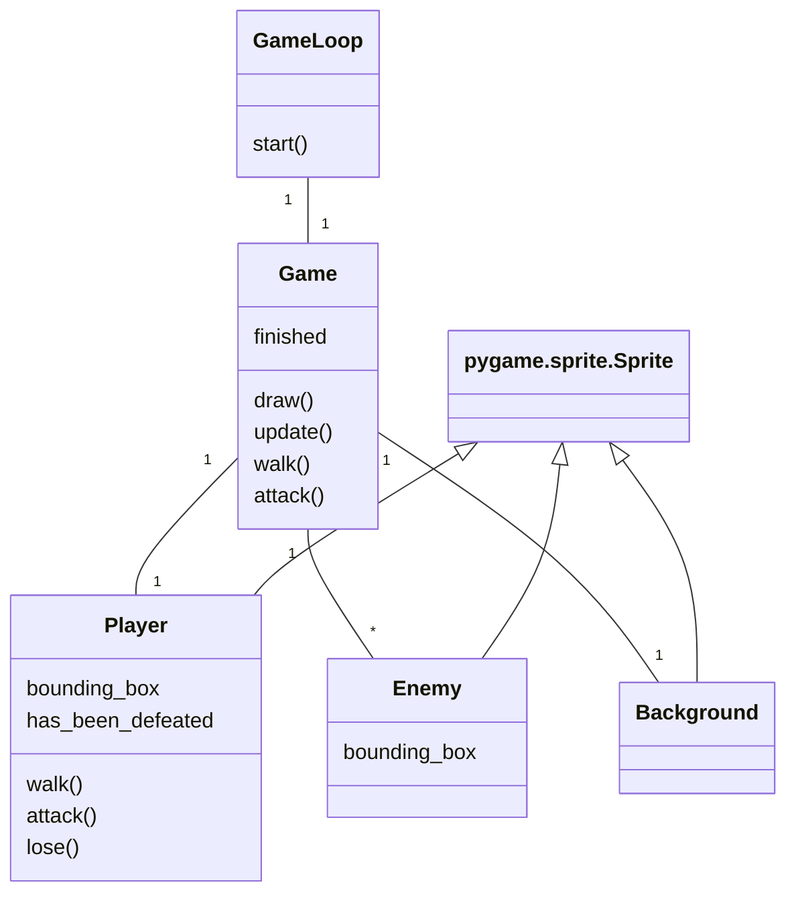

```mermaid
classDiagram
    GameLoop "1" -- "1" Game
    Game "1" -- "1" Player
    Game "1" -- "*" Enemy
    Game "1" -- "1" Background
    pygame.sprite.Sprite <|-- Player
    pygame.sprite.Sprite <|-- Enemy
    pygame.sprite.Sprite <|-- Background
    class GameLoop{
        start()
    }
    class Game{
        finished
        draw()
        update()
        walk()
        attack()
    }
    class Player{
        bounding_box
        has_been_defeated
        walk()
        attack()
        lose()
    }
    class Enemy{
        bounding_box
    }
```
