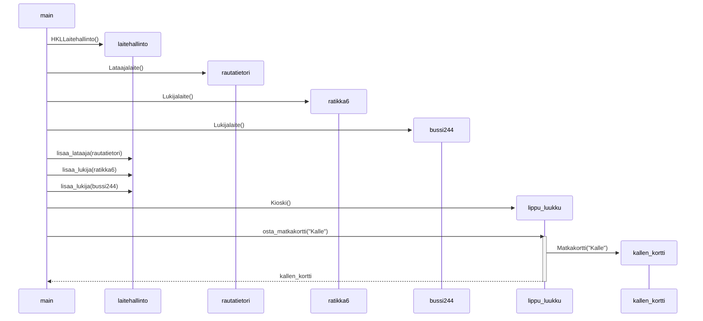

```mermaid
sequenceDiagram
    create participant main
    create participant laitehallinto
    main->>laitehallinto: HKLLaitehallinto()
    create participant rautatietori
    main->>rautatietori: Lataajalaite()
    create participant ratikka6
    main->>ratikka6: Lukijalaite()
    create participant bussi244
    main->>bussi244: Lukijalaite()
    main->>laitehallinto: lisaa_lataaja(rautatietori)
    main->>laitehallinto: lisaa_lukija(ratikka6)
    main->>laitehallinto: lisaa_lukija(bussi244)
    create participant lippu_luukku
    main->>lippu_luukku: Kioski()
    main->>lippu_luukku: osta_matkakortti("Kalle")
    activate lippu_luukku
    create participant kallen_kortti
    lippu_luukku->>kallen_kortti: Matkakortti("Kalle")
    lippu_luukku-->>main: kallen_kortti
    deactivate lippu_luukku
```
