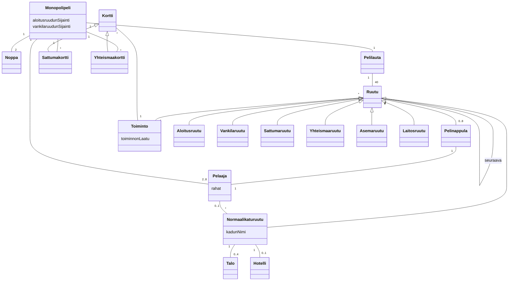

```mermaid
 classDiagram
    Monopolipeli "1" -- "2" Noppa
    Monopolipeli "1" -- "1" Pelilauta
    Monopolipeli "1" -- "*" Sattumakortti
    Monopolipeli "1" -- "*" Yhteismaakortti
    Pelilauta "1" -- "40" Ruutu
    Ruutu "1" -- "1" Ruutu : seuraava
    Ruutu "1" -- "0..8" Pelinappula
    Ruutu "*" -- "1" Toiminto
    Ruutu <|-- Aloitusruutu
    Ruutu <|-- Vankilaruutu
    Ruutu <|-- Sattumaruutu
    Ruutu <|-- Yhteismaaruutu
    Ruutu <|-- Asemaruutu
    Ruutu <|-- Laitosruutu
    Ruutu <|-- Normaalikaturuutu
    Normaalikaturuutu "1" -- "0..4" Talo
    Normaalikaturuutu "1" -- "0..1" Hotelli
    Pelinappula "1" -- "1" Pelaaja
    Pelaaja "2..8" -- "1" Monopolipeli
    Pelaaja "0..1" -- "*" Normaalikaturuutu
    Kortti "*" -- "1" Toiminto
    Kortti <|-- Sattumakortti
    Kortti <|-- Yhteismaakortti
    class Monopolipeli{
        aloitusruudunSijainti
        vankilaruudunSijainti
    }
    class Pelaaja{
        rahat
    }
    class Normaalikaturuutu{
        kadunNimi
    }
    class Toiminto{
        toiminnonLaatu
    }
```
